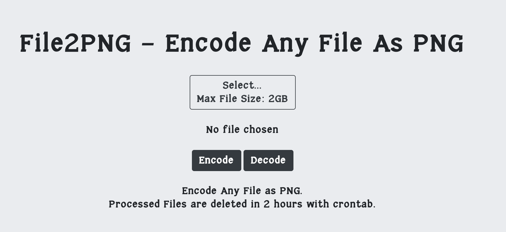

# File2PNG Web Application

This project is a front-end web application based on rekcuFniarB/File2PNG.

The website is live at <a href="https://file2png.com">File2PNG.com</a>



# Installation Guide 

Download the release archive & extract to the server root (Usually /var/www for Linux).

Grant execution access to the backend scripts located in the script folder. 

`chmod +x /path_of_project/scripts/* `

Enable rewrite mode for apache2 and make sure .htaccess is working.

`a2enmod rewrite`

Configure the crontab of the server to set processed temporary files deleted automatically after a period of time. (crontab file in the root of the repository can be used as reference).

```
# Delete temp files in 2 hours

*/5 * * * * find /var/www/file2png/public/tmp -type f -mmin +120 -delete
*/5 * * * * find /var/www/file2png/public/tmp_output -type f -mmin +120 -delete
```


